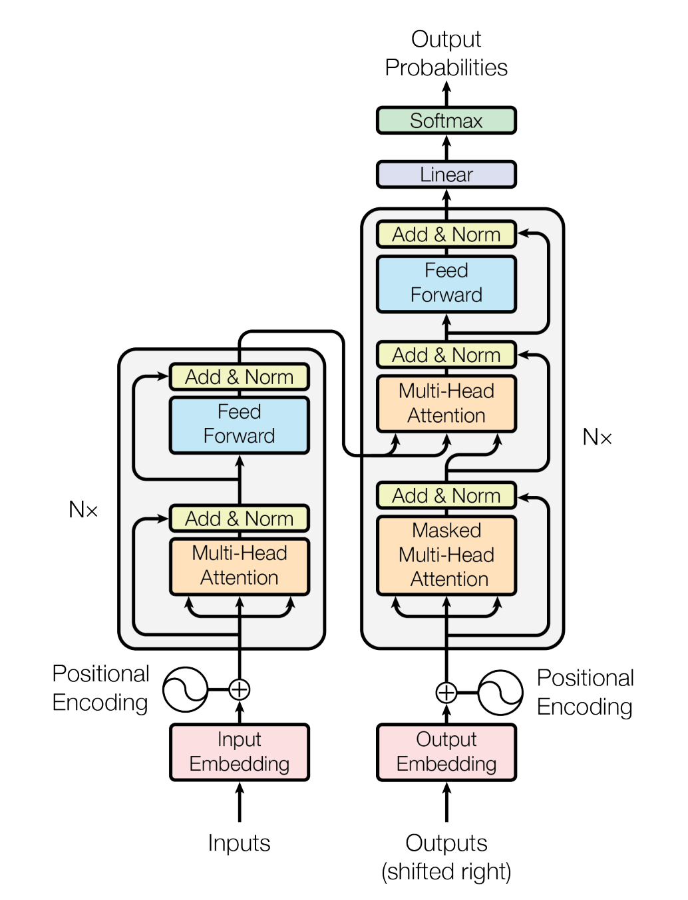
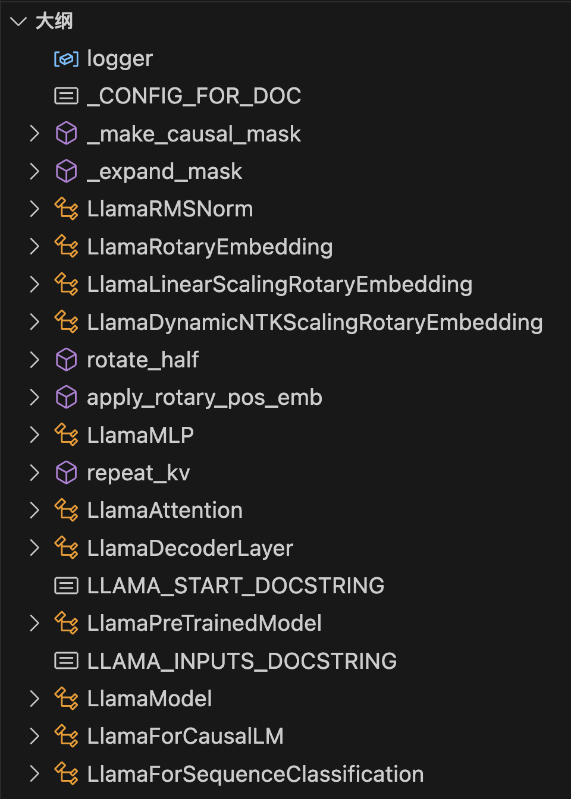

# Llama源码阅读

[Llama](https://ai.meta.com/blog/large-language-model-llama-meta-ai/)[^llama]是由Meta设计、训练并开源的大语言模型。相比于GPT-3，Llama模型更小，但是训练更加充分，性能更强，是开源社区最受欢迎的大模型之一。

本文主要阅读[Huggingface的Llama实现](https://huggingface.co/docs/transformers/v4.31.0/model_doc/llama)，重点关注相对于最早的Transformer[^attention]，Llama采用了哪些新的技术和优化。

<!-- more -->

## 预备条件

### Transformer

你需要知道什么是Transformer，知道它是一种自注意力神经网络。

<figure markdown>
  {width="400"}
  <figcaption>原始的Transformer网络结构</figcaption>
</figure>

强烈推荐阅读[原论文](https://proceedings.neurips.cc/paper_files/paper/2017/file/3f5ee243547dee91fbd053c1c4a845aa-Paper.pdf)，重点关注3.2节和3.3节对网络结构的描述。不过，如果在阅读了原论文之后你还是不确定它的实现也没关系，通过阅读Llama的代码，你会知道一个基于Transformer网络结构的语言模型是如何实现的。

### Pytorch

你需要知道基本的pytorch知识，知道它可以用于搭建神经网络。你可以在网上找一些最基本的pytorch教程，只要你能看懂下面的代码就可以了。

```python title="simple_network.py" linenums="1"
import torch
from torch import nn

# 一个简单的神经网络
class NeuralNetwork(nn.Module):
    def __init__(self, in_dim=3, hidden_dim=6, out_dim=2):
        super().__init__()
        self.linear_relu_stack = nn.Sequential(
            nn.Linear(in_dim, hidden_dim),
            nn.ReLU(),
            nn.Linear(hidden_dim, out_dim),
        )

    def forward(self, x: torch.Tensor):
        return self.linear_relu_stack(x)

# 前向传播
net = NeuralNetwork()
input_tensor = torch.randn(10, 3)
output_tensor = net(input_tensor)
```

## 代码准备

本文所阅读的代码以下面的版本为准：

```txt title="requirements.txt" linenums="1"
transformers==4.31.0
torch==2.0.1
```

transformers库采用[单模型文件策略](https://huggingface.co/blog/zh/transformers-design-philosophy)，我们只需要阅读[`modeling_llama.py`](https://github.com/huggingface/transformers/blob/v4.31.0/src/transformers/models/llama/modeling_llama.py)即可。

## 源码阅读

### 了解代码结构

我们首先观察一下`modeling_llama.py`文件里有哪些类和函数，在vscode中打开左边的大纲。

<figure markdown>
  {width="400"}
  <figcaption>模型文件大纲</figcaption>
</figure>

不难猜测，LlamaModel类就是我们要找的模型主干，而LlamaAttention、LlamaMLP等类则是模型中具体的网络模块。更进一步，如果你对Transformer架构比较熟悉的话，可能会猜测LlamaDecoderLayer是每一层的Transformer网络，其中包含了LlamaAttention和LlamaMLP模块。

### 阅读具体实现

#### LlamaMLP

#### RMSNorm

```python title="modeling_llama.py" linenums="75-89"
class LlamaRMSNorm(nn.Module):
    def __init__(self, hidden_size, eps=1e-6):
        """
        LlamaRMSNorm is equivalent to T5LayerNorm
        """
        super().__init__()
        self.weight = nn.Parameter(torch.ones(hidden_size))
        self.variance_epsilon = eps

    def forward(self, hidden_states):
        input_dtype = hidden_states.dtype
        hidden_states = hidden_states.to(torch.float32)
        variance = hidden_states.pow(2).mean(-1, keepdim=True)
        hidden_states = hidden_states * torch.rsqrt(variance + self.variance_epsilon)
        return self.weight * hidden_states.to(input_dtype)
```

#### Rotary Embedding


[^llama]: Touvron et al. [LLaMA: Open and Efficient Foundation Language Models](https://arxiv.org/abs/2302.13971) (arXiv 2023)
[^attention]: Vaswani et al. [Attention Is All You Need.](https://proceedings.neurips.cc/paper_files/paper/2017/file/3f5ee243547dee91fbd053c1c4a845aa-Paper.pdf) (NIPS 2017)
