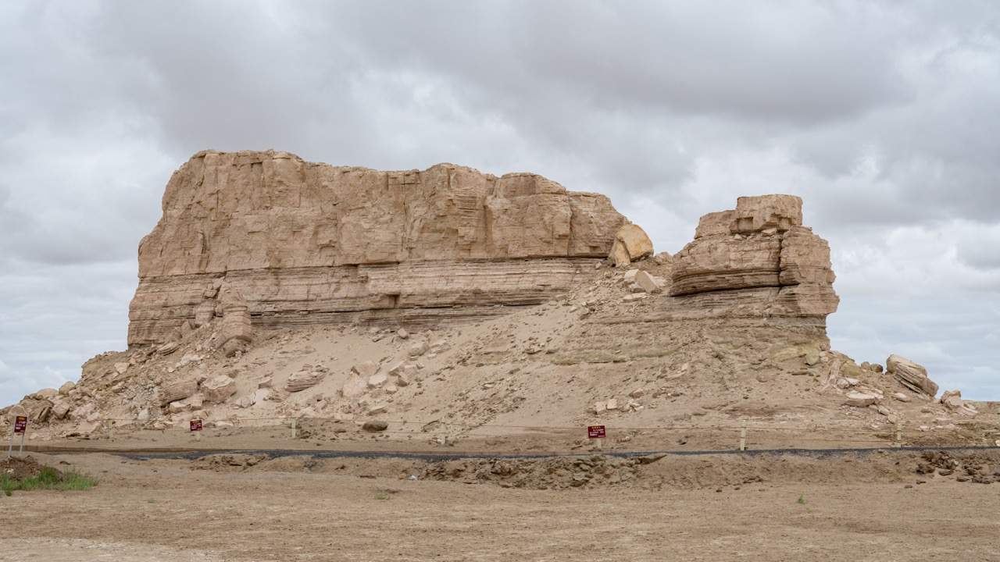
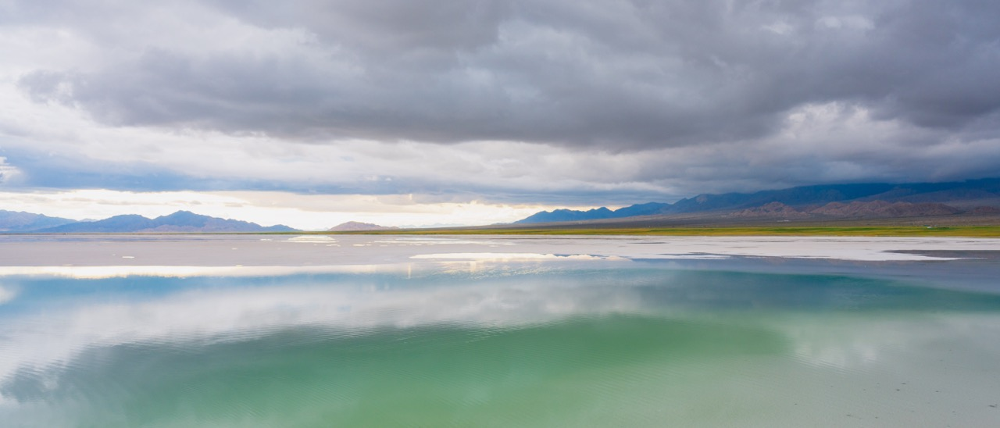
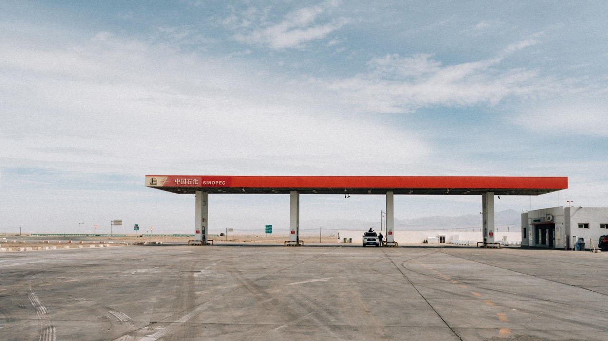
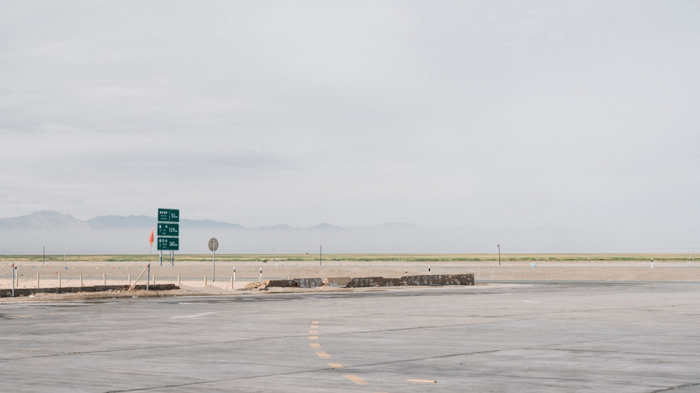
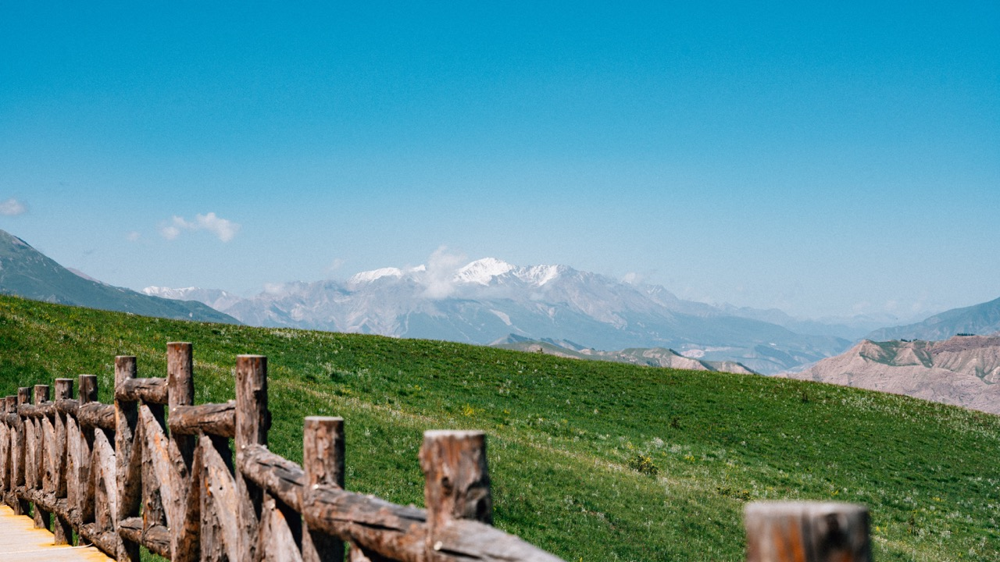

# 青海

2022年的夏天和母亲一起去了青海，草原荒漠的地貌对于来自长三角地区的我来说非常新奇。可惜前一半旅程一直有雨，后面几天才见到蓝天。

<!-- more -->

<figure markdown>
  
  <figcaption>雅丹地貌</figcaption>
</figure>

<figure markdown>
  
  <figcaption>盐湖</figcaption>
</figure>

<figure markdown>
  
  <figcaption>西北大环线上的加油站</figcaption>
</figure>

<figure markdown>
  
  <figcaption>西北大环线上的路标</figcaption>
</figure>

<figure markdown>
  
  <figcaption>祁连山</figcaption>
</figure>
