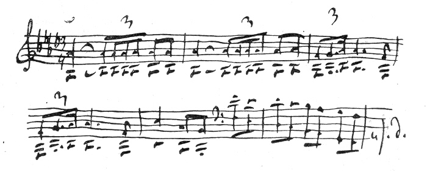
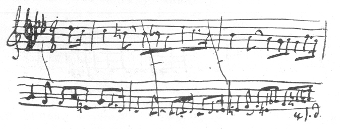
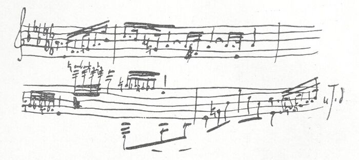
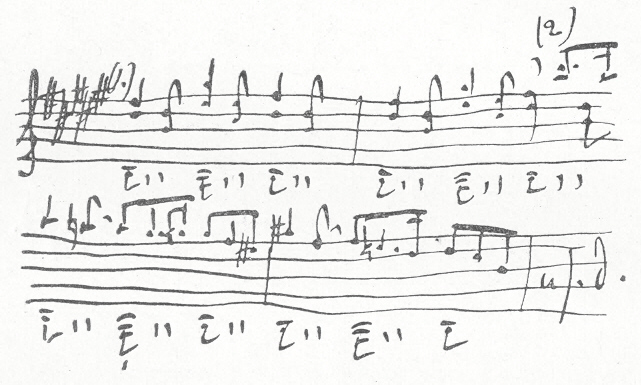
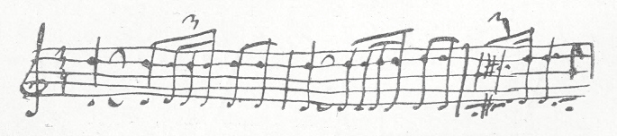

---
date:
  created: 2023-01-29
  updated: 2023-10-21
readtime: 30
authors:
  - ludwig
categories:
  - 生活
---

# 柴可夫斯基写给梅克夫人的信

某日在[Tchaikovsky Research](https://en.tchaikovsky-research.net/pages/Main_Page)闲逛，读到了[1878年柴可夫斯基在佛罗伦萨写给梅克夫人的信](https://en.tchaikovsky-research.net/pages/Letter_763)，好感动好感动。柴可夫斯基是我最喜欢的古典作曲家之一，个人觉得阅读这封信对于理解柴可夫斯基的不少作品很有帮助。

信本身是讨论第四交响曲的，也就是“我们的交响曲”。另外信的结尾处柴可夫斯基提到了他即将前往瑞士，也就是他写作小提琴协奏曲的地方。

<!-- more -->

英文翻译全文：

> 
$Florence\ \frac{1\ March}{17\ February}\ 1878$

> How much joy your letter brought me today, my precious Nadezhda Filaretovna. How immeasurably happy I was that the symphony pleased you, that when hearing it you experienced the feelings with which I was suffused when I wrote it, and that the music sank into your heart.
> 
> You asked me whether there is a definite programme to this symphony? Usually when this question is put to me about a symphonic work my answer is: none! Indeed, this is a difficult question to answer. How can one put into words the intangible sensations which one experiences when writing an instrumental work without a specific subject? **This is a purely lyrical process. This is, fundamentally, an unburdening of the soul in music, with its essence distilled into sounds, in the same manner in which a lyrical poet expresses himself in verse. The only difference is that music has much more powerful means and a more subtle language with which to express thousands of different emotions and frames of mind.** Usually the seed of a future work will manifest itself suddenly in unexpected ways. If the soil is fertile, i.e. if there is a disposition to work, the seed will take root with remarkable power and swiftness, allowing buds to emerge from the soil, followed by leaves, branches and, ultimately, flowers. I cannot define the creative process without resorting to metaphors. The difficulty lies in the fact that the seed requires favourable conditions in which to germinate. Everything else happens by itself. It would be futile for me to try to express to you in words the immeasurable bliss of all the feelings that seize me when a main idea appears, and when it begins to flourish into a particular form. I forget everything and become literally like a madman, everything within me shakes and pulses, with barely time to scribble out my sketches as one idea runs into another... Sometimes in the midst of this magical process, some external stimulus will jolt me out of this somnambuilistic state. Somebody might call, a servant enter, or a clock will strike and remind me that I need to go out on business... Such breaks are inexpressibly burdensome. Sometimes inspiration will fly away for quite a while. It's necessary to search for it, and often in vain. It is frequently necessary to fall back on an altogether cold, rational and technical working method. Perhaps it is because of this that the greatest masters have moments with an absence of organic flair, where the seams within the whole appear artificially sewn together. But it is impossible for it to be otherwise. If the condition of the artist's soul called inspiration that I am attempting to describe to you were to be continued without interruption, it should be impossible to live for a single day. The strings would snap, and the instrument should be dashed into smithereens! Only one thing is necessary: that the principal idea and the general outlines of all the movements did not come about by striving, but rather that they present themselves as a result of that supernatural, incomprehensible, and unfathomable force that is called inspiration.
> 
> But I have digressed on an aside without answering your question. **In our symphony there is a programme, i.e. it is possible to express in words what it is trying to say, and to you, and only to you, I am able and willing to explain the meaning both of the whole and of the separate movements.** Of course, I can do this only in general terms.
> 
> The introduction is the seed of the whole symphony, undoubtedly the main idea:
> 
> <figure markdown>
>   {width="600"}
> </figure>
>
> **This is Fate: this is that fateful force which prevents the impulse to happiness from attaining its goal, which jealously ensures that peace and happiness shall not be complete and unclouded, which hangs above the head like the sword of Damocles, unwaveringly, constantly poisoning the soul. It is an invincible force that can never be overcome — merely endured, hopelessly.**
> 
> <figure markdown>
>   {width="600"}
> </figure>
>
> The bleak and hopeless feelings grow stronger and intense. Is it not better to escape from reality and to immerse oneself in dreams:
> 
> <figure markdown>
>   {width="600"}
> </figure>
>
> Oh joy! Out of nowhere a sweet and gentle day-dream appears. Some blissful, radiant human image hurries by and beckons us away:
>
> <figure markdown>
>   {width="600"}
> </figure>
>
> How wonderful! How distant the obsessive first theme of the allegro now sounds! Gradually the soul is enveloped by daydreams. Everything gloomy and joyless is forgotten. Here it is, here it is — happiness!
> 
> No! These were daydreams, and Fate wakes us from them:
>
> <figure markdown>
>   {width="600"}
> </figure>
>
> And thus **all life is an unbroken alternation of harsh reality with fleeting dreams and visions of happiness...** No haven exists... Drift upon that sea until it engulfs and submerges you in its depths. That, roughly, is the programme of the first movement.
> 
> The second movement of the symphony expresses another aspect of sadness. This is that melancholy feeling which comes in the evening when, weary from one's toil, one sits alone with a book — but it falls from the hand. **There come a whole host of memories. It is sad that so much is now in the past, albeit pleasant to recall one's youth. Both regretting the past, and yet not wishing to begin life over again. Life is wearisome. It is pleasant to rest and look around. Memories abound! Happy moments when the young blood boiled, and life was satisfying. There are also painful memories, irreconcilable losses. All this is now somewhere far distant. It is both sad, yet somehow sweet to be immersed in the past...**
> 
> The third movement expresses no specific feeling. This is whimsical arabesques, vague images which can sweep past the imagination after drinking a little wine and feeling the first phases of intoxication. The spirit is neither cheerful, nor sad. Thinking about nothing in particular, giving free rein to the imagination, which somehow begins to paint strange pictures... Amid these memories there suddenly comes a picture of drunken peasants and a street song... Then, somewhere in the distance, a military procession passes. These are completely incoherent images which sweep through the head as one falls asleep. They have nothing in common with reality; they are strange, wild, and incoherent...
> 
> The fourth movement. If within yourself you find no reasons for joy, then look at others. Go out among the people. See how they can enjoy themselves, surrendering themselves wholeheartedly to joyful feelings. Picture the festive merriment of ordinary people. Hardly have you managed to forget yourself and to be carried away by the spectacle of the joys of others, than irrepressible fate appears again and reminds you of yourself. But others do not care about you, and they have not noticed that you are solitary and sad. O, how they are enjoying themselves! How happy they are that all their feelings are simple and straightforward. **Reproach yourself, and do not say that everything in this world is sad. Joy is a simple but powerful force. Rejoice in the rejoicing of others. To live is still possible.**
> 
> That, my dear friend, is all I can explain to you about the symphony. Of course, this is vague and incomplete. But an intrinsic quality of instrumental music is that it does not yield to detailed analysis. **Where words end, music begins, as Heine remarked.**
> 
> It's already late. **I'm not writing anything to you about Florence at this time, except that its very, very pleasant memories will stay with me for my whole life. At the end of next week, that is, around the 24th (by our style), I am thinking of going to Switzerland, where I intend to live quietly for the whole of March, gradually writing compositions in a variety of small forms. And so, when you receive this letter, my address shall once again be: Clarens, Canton de Vaud, Villa Richelieu.**
> 
> Thank you, my dear, for today's letter. I still have had no word from my Moscow friends. I will write to you about my opinion of them in detail.
> 
> 
P. Tchaikovsky

>
> ---
>
> P. S. Just as I was about to put the letter in an envelope, I re-read it and was horrified at the incoherence and inadequacy of the programme I sent to you. **This is the first time in my life that I have attempted to translate musical thoughts and images into words, and I could not manage to do this adequately. I was severely depressed last winter when writing the symphony, and it serves as a faithful echo of what I was experiencing.** But it is known as an echo. How can it be translated into a clear and coherent succession of words? I do not know how to do that. I have already forgotten so much. They remain general recollections of the passions and mysterious feelings that I experienced. I am very, very curious about what my Moscow friends will say. Farewell.
>
> 
Yours P. Tchaikovsky

>  
> Yesterday I spent the evening at the National Theatre and laughed a great deal. Italian comedy is vulgar, devoid of subtlety and grace, but immensely enjoyable.
>
